# _NutriCode_ Development Report

Welcome to the documentation pages of _NutriCode_!

This Software Development Report, tailored for LEIC-ES-2024-25, provides comprehensive details about _NutriCode_, from high-level vision to low-level implementation decisions. It’s organised by the following activities. 

* [Business modeling](#Business-Modelling) 
  * [Product Vision](#Product-Vision)
  * [Features and Assumptions](#Features-and-Assumptions)
  * [Elevator Pitch](#Elevator-pitch)
* [Requirements](#Requirements)
  * [User stories](#User-stories)
  * [Domain model](#Domain-model)
* [Architecture and Design](#Architecture-And-Design)
  * [Logical architecture](#Logical-Architecture)
  * [Physical architecture](#Physical-Architecture)
  * [Vertical prototype](#Vertical-Prototype)
* [Project management](#Project-Management)
  * [Sprint 0](#Sprint-0)
  * [Sprint 1](#Sprint-1)
  * [Sprint 2](#Sprint-2)
  * [Sprint 3](#Sprint-3)
  * [Sprint 4](#Sprint-4)
  * [Final Release](#Final-Release)

Contributions are expected to be made exclusively by the initial team, but we may open them to the community, after the course, in all areas and topics: requirements, technologies, development, experimentation, testing, etc.

Please contact us!

Thank you!

* José Maio (up202404872@up.pt)
* Miguel Mimoso (up202407610@up.pt)
* Vasco Guimarães (up202403604@up.pt)
* Victor Gomez (up202406138@up.pt)
* Rodrigo Pina (up202404436@up.pt)

---
## Business Modelling

Business modeling in software development involves defining the product's vision, understanding market needs, aligning features with user expectations, and setting the groundwork for strategic planning and execution.

### Product Vision

For everyone, 
who want to make informed and healthier food choices but lack the time to reserach every product,
the NutriCode 
is a mobile app that instantly reveals harmful ingredients and allergens by scanning a product bar code and provides better alternatives.
Unlike manual label reading,
our app gives a clear virtual verdict in x seconds.

### Features and Assumptions

Features

- **BarCode Scanner** - scan any product barcode using your phone's camera
- **Ingredient Analysis** - automatic detection of harmful additives, allergens or ultra-processed substances
- **Traffic Light System** - visual green/red verdict for quick decision making
- **Ingredient Details** - tap any flagged ingredient to see why it's harmful
- **Product History** - list previously scanned products
- **Search by Name** - find products manually when barcode is unavailable
- **Allergen Filter** - personalize alerts based on your specific allergies or intolerances
- **Favorites and Blacklists** - save safe products and flag ones to avoid

Assumptions

- Users have a smartphone with working camera
- Users will be primarily scanning packaged food products (not fresh produce)

Dependencies

- Barcode scanning via camera API
- Product Database

### Elevator Pitch

We've all been there — standing in a supermarket aisle, flipping a product over, trying to make sense of an ingredient list full of words we can't pronounce. It takes time, requires knowledge most of us don't have, and we usually just give up and buy it anyway.
Our app changes that. You scan the barcode, and almost instantly you get a green, yellow, or red verdict — no nutrition degree required. And if something is flagged, you can tap it and read exactly why it's harmful, in plain language.
It's faster than reading the label, smarter than guessing, and designed for anyone who wants to make better food choices without it feeling like homework.
If you care about what goes into your body — or know someone who does — NutriCode is the app for you.

## Requirements

### User Stories

### US01 - Scan a Product
As a student doing grocery shopping, I want to scan a product's barcode using 
my phone camera so that I can instantly retrieve its ingredient information 
without having to read the small print on the label manually.

*Mockup:* 

  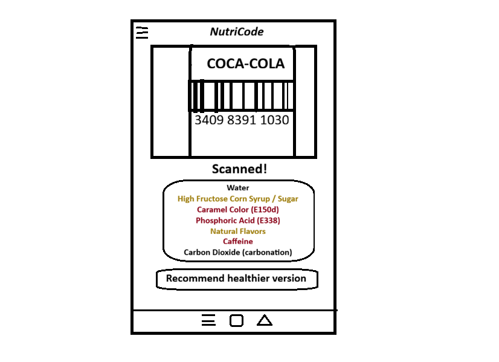

*Acceptance Tests:*

Scenario: Successful barcode scan

  Given the user has the app open on the scan screen
  And the user points the camera at a valid product barcode
  When the barcode is recognized
  Then the app displays the product name and ingredient analysis within 3 seconds

Scenario: Product not found in database

  Given the user scans a valid barcode
  When the product is not found in the Open Food Facts database
  Then the app displays a "Product not found" message
  And suggests the user search by product name instead

*Value:* Must Have | *Effort:* 10

### US02 - View Harmful Ingredients
As a health-conscious user, I want to see harmful ingredients highlighted so that I can decide whether to buy the product.

*Acceptance Tests*:

Scenario: Harmful Ingredients Present and Highlighted

Given the user is viewing a product's ingredient details, 
when the product contains one or more flagged harmful ingredients,
then those ingredients are highlighted (e.g. in red or with a warning icon), and a brief explanation of why each is flagged is displayed.

Scenario: No Harmful Ingredients Found

Given the user is viewing a product's ingredient details,
when none of the ingredients are flagged as harmful,
then the app displays a "No harmful ingredients detected" message so the user can shop with confidence.

- *Value:* Must Have | *Effort:* 20

### US03 - Traffic Light Verdict
As a busy student, I want to see an immediate green/yellow/red verdict after scanning so that I can make a purchase decision in under 3 seconds.

*Acceptance Tests:*

Scenario: Successful scan with green verdict

  Given the product only has safe ingredients 
  When the scan is completed 
  Then A green circle and a text message saying “All ingredients are safe” are displayed. 

  Given a green verdict
  When the user taps “View Details” 
  Then the app navigates to the ingredient list without error.

Scenario: Product barcode not found in database

  Given a scanned barcode has no match in the database 
  When the lookup completes 
  Then a brown circle and a text message saying “Product Not Found” are displayed along with the barcode number.

  Given the Product Not Found is shown
  When the user taps “Search the Internet” 
  Then the default web browser opens and automatically searches for the barcode number also displayed.

  Given the Product Not Found is shown
  When the user taps “Scan again” 
  Then the camera reopens and previous scan is dismissed.

- *Value:* Must Have | *Effort:* 13

### US04 - Ingredient Details
As a curious user, I want to tap on a flagged ingredient and read why it is harmful so that I can understand what I am putting in my body.

*Acceptance Tests:*

Scenario: User taps red-flagged ingredient and reads explanation

  Given a red-flagged ingredient is shown
  When the user taps it 
  Then a description panel appears containing the ingredient name and the stored explanation

  Given the description panel is open 
  When the user taps outside of it 
  Then the panel closes and the ingredient list is fully visible again.

Scenario: Explanation data unavailable

  Given a red-flagged ingredient is shown whose explanation is not in the database, 
  When the user taps it 
  Then a description panel appears containing a message saying the explanation is not available and a button to search about it online.

  Given a message saying the explanation is unavailable 
  When the user taps the “Search online” button 
  Then the device browser opens with a search query pre-filled with the ingredient name

  Given the description panel saying the content is unavailable
  When the user taps outside of it 
  Then the ingredient list is fully shown again.

  
- *Value:* Should Have | *Effort:* 13

### US05 - Allergen Filter
As a user with food allergies, I want to configure my personal allergens so that the app alerts me whenever a scanned product contains them.

*Acceptance Tests:*

Scenario: Allergen match detected on scan

 Given the user has configured 'Milk' as a personal allergen
 When the user scans a product containing milk
 Then a red alert banner is shown immediately with the allergen name highlighted
 And a 'See Alternatives' button appears

 Given the user has set 'Soy' as a personal allergen
 And the user scans a product containing soy lecithin
 When the scan result loads
 Then a 'See Alternatives' button appears below the alert banner

 Given the user has set 'Eggs' and 'Nuts' as personal allergens
 And the user scans a product containing eggs
 When the scan result loads
 Then only the matching allergen 'Eggs' is highlighted in the alert
 
Scenario: Product has no allergen data

 Given the user has allergens configured and scans a product with no allergen data
 When the scan result loads
 Then a yellow warning is shown: 'Allergen data unavailable — check the physical label'
 And no green 'safe' banner is shown

 Given the user has set 'Celery' as a personal allergen
 And the user scans a recently added artisanal soup with no allergen mapping
 When the scan result loads
 Then no green 'safe' banner is displayed anywhere on the result screen

 
- *Value:* Should Have | *Effort:* 8

### US06 - Scan History
As a returning user, I want to access a history of previously scanned products so that I can re-consult them without scanning again.

Scenario: User opens history with previous scans

 Given the user has previously scanned at least one product
 When the user opens the History screen
 Then a list of previously scanned products is shown, ordered by most recent first

 Given the user scanned 50 different products over the last month
 And the user opens the app after a week without scanning
 When the user opens the History screen
 Then all 50 products are listed with their name, thumbnail and scan date

Scenario: History is empty

 Given the user has no scan history
 When the user opens the History screen
 Then an empty state is shown with a message and a 'Scan Now' button

 Given the user has no scan history
 And the user lands on the History screen for the first time
 When the user taps the 'Scan Now' button
 Then the app navigates directly to the scan screen

 Given the user has no scan history
 And the user has just switched to a new device and restored the app
 When the user opens the History screen
 Then the empty state is shown with no leftover data from the previous device

 
- *Value:* Should Have | *Effort:* 3

### US07 - Search by Product Name
As a user with a damaged barcode, I want to search for a product by name so that I can still access its ingredient information.

*Acceptance Tests:*

Scenario: Successful Search and View Ingredients.
Description: User enters a product name, selects from results, and views ingredients.
Acceptance Tests: Given the user is on the search screen, when they enter "Coca-Cola" in the search bar and submit, then a list of matching products appears, and selecting one displays its ingredient details.

Exceptional Scenario: No Results Found
Description: User searches for a non-existent or misspelled product name, receiving a helpful error message with suggestions like scan bar-code.
Given the user is on the search screen, when they enter "Koka-kola" (misspelled) and submit, Then a "No results found" message displays, and no ingredient details load.
- *Value:* Could Have | *Effort:* 5

### US08 - Save Favourite Products
As a regular shopper, I want to save trusted products to a favourites list so that I can quickly confirm they are still safe on future trips.

*Acceptance Tests:*

Scenario: Add and View Favorite.
Description: From a product detail page, user adds to favorites; later accesses the list to view saved items.
Acceptance Tests: Given the user is viewing a product detail, when they tap "Add to Favorites," Then the product appears in the favorites list, and tapping it shows updated ingredient info.

Exceptional Scenario: Remove Favorite or Offline Access
Description: User removes an item from favorites; or accesses list offline, seeing cached data with a warning for potential updates.
Acceptance Tests: Given the user has favorites saved and is offline, when they open the favorites list, then cached products appear.
- *Value:* Could Have | *Effort:* 2

### Domain model

  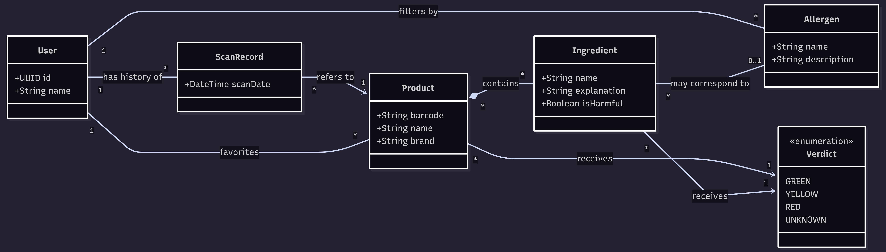

## Architecture and Design

The logical architecture of NutriCode is organized into distinct packages that separate the mobile application's internal concerns from its external dependencies. This structure ensures a clean separation of concerns, making the codebase easier to maintain, test, and scale.

### Logical architecture

The logical architecture of NutriCode is organized into distinct packages that separate the mobile application's internal concerns from its external dependencies. This structure ensures a clean separation of concerns, making the codebase easier to maintain, test, and scale.

The system is encapsulated within a main `Logical View`, which is divided into two primary subsystems: `app` and `External Systems`.

#### 1. App
This subsystem contains the core layers of the mobile application itself:
* **User Interface:** Manages the presentation layer, including all screens, UI widgets, and navigation logic. It depends directly on the Business Logic layer to trigger actions.
* **Business Logic:** Acts as the brain of the app. It handles the core domain operations, such as triggering a scan, applying allergen filters, and calculating the final traffic-light verdict. 
* **Data Access:** Responsible for abstracting data retrieval and storage. It uses repositories to fetch data from external sources or local caches, ensuring the Business Logic layer doesn't need to know where the data comes from.

#### 2. External Systems
This subsystem represents the boundaries outside the core application code:
* **Open Food Facts API:** An external REST API that the Business Logic layer relies on to fetch raw product and ingredient data based on the scanned barcodes.
* **Local Database:** The device's local storage (e.g., SQLite), which the Data Access layer depends on to persist user-specific data like scan history and configured allergens.

### Physical architecture

The physical architecture of NutriCode follows a standard client-server deployment model, consisting of a mobile client device and an external data server. This section outlines the physical nodes, the software components deployed on them, and the rationale behind our technological choices.

**1. Mobile Device (Client Node)**
This is the user's physical smartphone (Android or iOS). It hosts the core executable artifacts of our system:
* **App (Flutter):** The main application containing both the User Interface and the Business Logic. 
  * *Justification:* We chose **Flutter** (and the Dart language) because it allows us to build natively compiled applications for both mobile platforms from a single codebase, significantly speeding up development time. It also has excellent, highly responsive plugins for hardware access (like the device camera for barcode scanning).
* **Local Storage:** The local database residing on the device's storage.
  * *Justification:* We are utilizing **SQLite** (and Shared Preferences) to persist user data, such as their configured allergen filters, scan history, and favorite products. This ensures that users can access their saved data even when offline and reduces unnecessary network requests.

**2. Open Food Facts Server (External Node)**
This represents the remote cloud infrastructure that hosts the product database.
* **Open Food Facts API:** A RESTful web service.
  * *Justification:* Instead of building and maintaining our own proprietary database of millions of food products, we chose to integrate with the **Open Food Facts API**. It is a comprehensive, open-source, and crowdsourced database that provides all the nutritional and ingredient data we need based on standard EAN/UPC barcodes.

**Connections**
The Mobile Device communicates with the Open Food Facts Server over the internet via standard **HTTPS** protocols. The app sends an HTTP GET request containing the scanned barcode string, and the server responds with a JSON payload containing the product's ingredient details, which the app then parses and evaluates.

### Vertical prototype

In Iteration 0, we successfully implemented a vertical prototype, a thin end-to-end slice of the application that validates our technology stack and core architecture. Key achievements include:

- **Barcode Scanning:** Integrated the device camera using the `mobile_scanner` package, allowing the user to scan real product barcodes directly from the app.
- **Manual Barcode Input:** Added a text field below the camera so users can manually enter a barcode number when scanning is not possible.
- **Product Data Retrieval:** Connected the app to the [Open Food Facts API](https://world.openfoodfacts.org/) to fetch real product data (name, brand, image, ingredients, and allergens) based on the scanned barcode.
- **Ingredient Analysis with Color Coding:** Ingredients are displayed with a traffic-light color system — harmful ingredients appear in **red**, moderate-concern ingredients in **yellow/orange**, and safe ingredients in **green**.
- **User Authentication Screens:** Developed Login and Registration screens with a clean, modern dark-themed UI.
- **Welcome Screen:** Created an initial welcome screen with a custom illustration and a "Get Started" button to guide users into the app.

Some screenshots and demos:

  <b>1. Welcome Screen</b>&emsp;&emsp;&emsp;
  <b>2. Login</b>&emsp;&emsp;&emsp;
  <b>3. Register</b>

  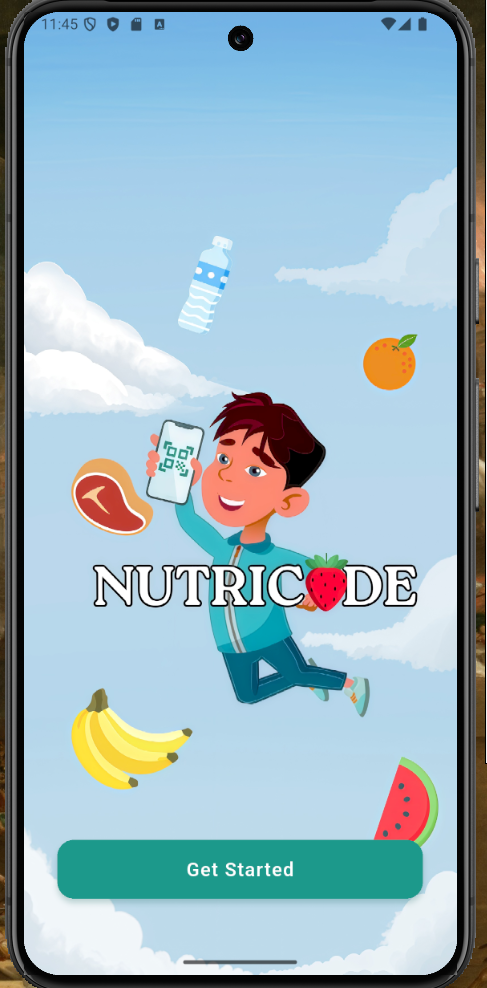&emsp;
  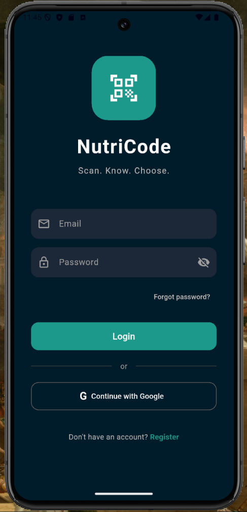&emsp;
  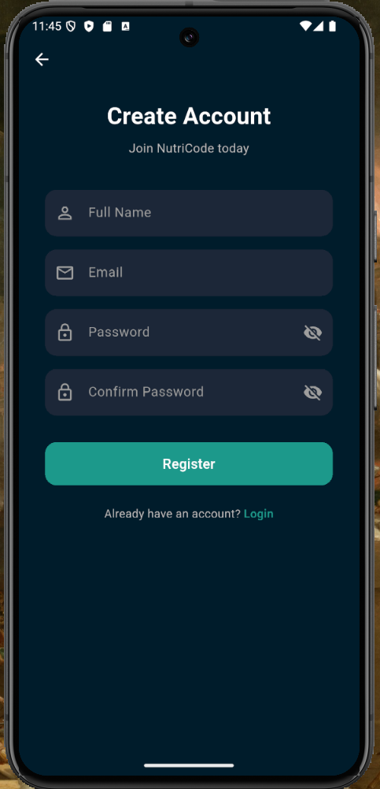

  <b>4. Scanner</b>&emsp;&emsp;&emsp;
  <b>5. Product Info</b>

  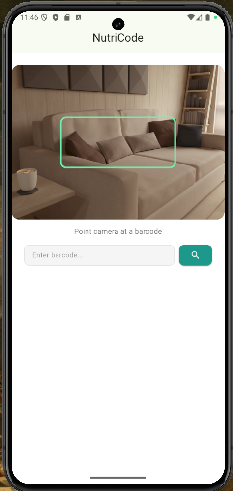&emsp;
  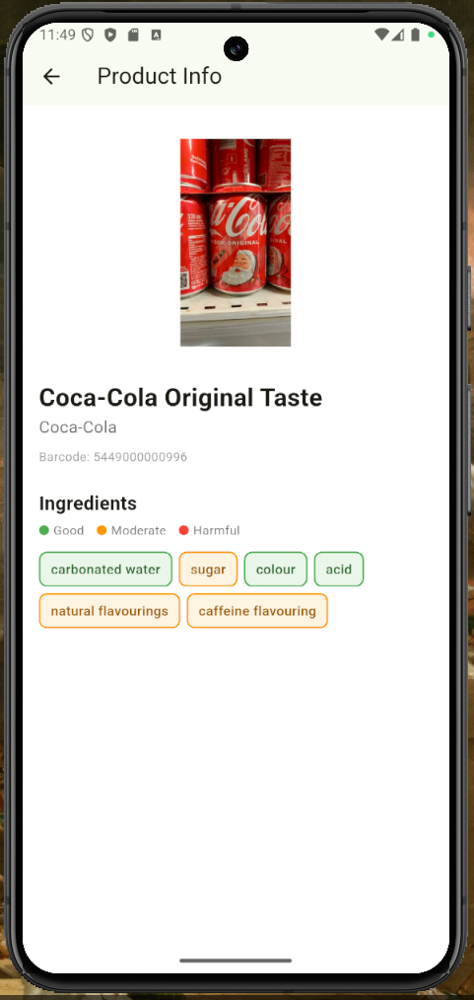

**Note on Current Functionality:** Please be aware that in this iteration, some of the buttons and interactive elements within the app are not fully operational. These elements are part of our planned features and will be developed and integrated in subsequent iterations. The login and registration screens are visual-only at this stage (no authentication backend).

## Project management

### Sprint 0

**Retrospective**

- **Did well:**
  - Effective team collaboration: All four members (José, Miguel, Vasco, Victor) worked together in a streamlined and productive manner, with clear communication throughout the iteration.
  - Well-defined product vision: We aligned early on the app's core purpose and features, which allowed us to move quickly into user story writing and architectural decisions.
  - Solid vertical prototype: We successfully delivered a working end-to-end slice of the app — from barcode scanning to ingredient analysis — validating our choice of Flutter and the Open Food Facts API.

- **Do differently:**
  - Task distribution: In future iterations, we plan to split tasks more explicitly across team members to enable parallel development and reduce bottlenecks.
  - Earlier testing on physical devices: Most testing was done on emulators; we want to test on real Android devices earlier in the next sprint.

- **Puzzles:**
  - Firebase integration: We are still evaluating how to best integrate Firebase Authentication and Firestore for user accounts, scan history, and personalized allergen profiles.

**Board at the End of Iteration 0**

  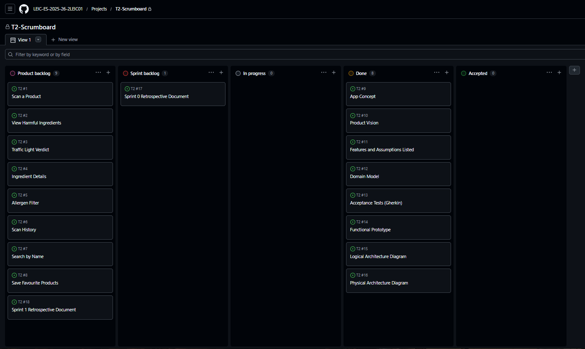

### Sprint 1

**Retrospective**

- **Did well:**
  - Feature expansion: We extended the prototype to support view harmful products and implement the traffic light veridict. Besides that now the app can scan a product.
  - Improved task distribution: Work was more clearly divided among José, Miguel, Vasco, and Victor, enabling parallel development and reducing idle time.

- **Do differently:**
  - Better estimation: Some tasks took shorter than expected, so we aim to improve sprint planning and estimation accuracy.
  - Improve branch management: Branches were not always used effectively, leading to larger and more complex merges. We aim to adopt a clearer branching strategy (e.g., feature branches with smaller, more frequent merges) to improve collaboration and code integration.
  - Increase test coverage: There was a lack of automated tests, which made it harder to catch bugs early and ensure stability. In the next sprint, we plan to introduce unit and widget tests and integrate testing into the development workflow.

- **Puzzles:**
  - Data reliability: Some product data from the Open Food Facts API is incomplete or inconsistent, raising challenges for accurate allergen detection.

**Board at the End of Iteration 1**

  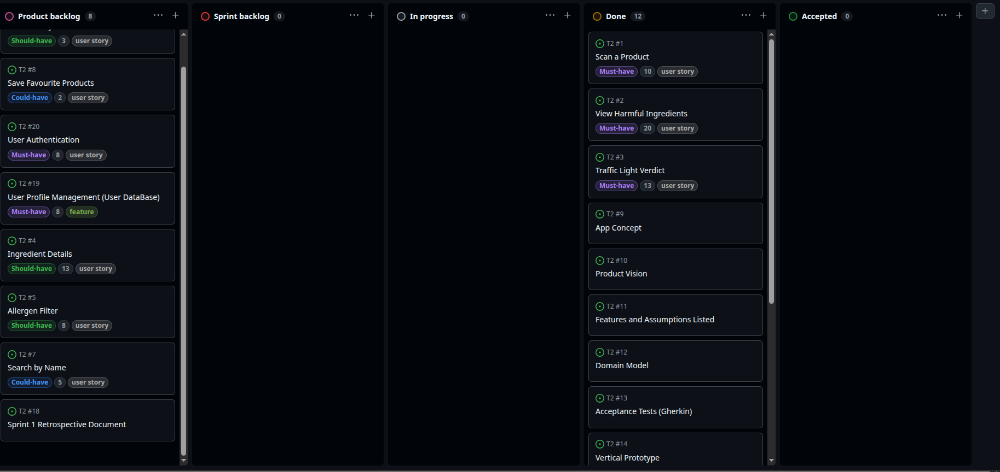

**Happiness Meter**

  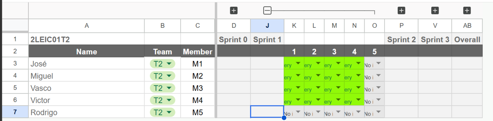

### Sprint 2

**Retrospective**

- **Did well:**
  - Feature development: We successfully implemented several core features, including product search by name, allergen filtering, ingredient detail visualization, user authentication, and user profile management with database integration.
  - Testing and validation: A significant amount of testing was carried out during this sprint, helping identify issues early and improving the stability and reliability of the application.   
  - System integration: We made good progress integrating frontend features with backend and database components, especially in authentication and user profile management.

- **Do differently:**
  - Earlier integration testing: Although many tests were completed, some integration issues were only discovered later in development. Next sprint, we aim to test integrated features earlier.
  - Documentation: Some implementation details and testing results were not always documented consistently. Improving technical documentation could make collaboration easier.

- **Puzzles:**
  - Authentication edge cases: Further testing may be needed to validate all authentication and profile update scenarios, especially error handling and database synchronization.

**Board at the End of Iteration 2**

   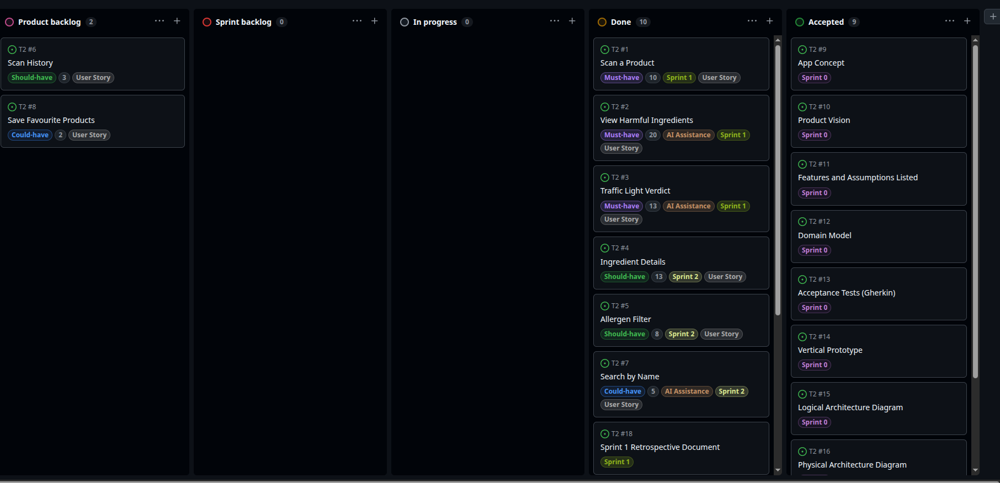

**Happiness Meter**

### Sprint 3

### Sprint 4

### Final Release
