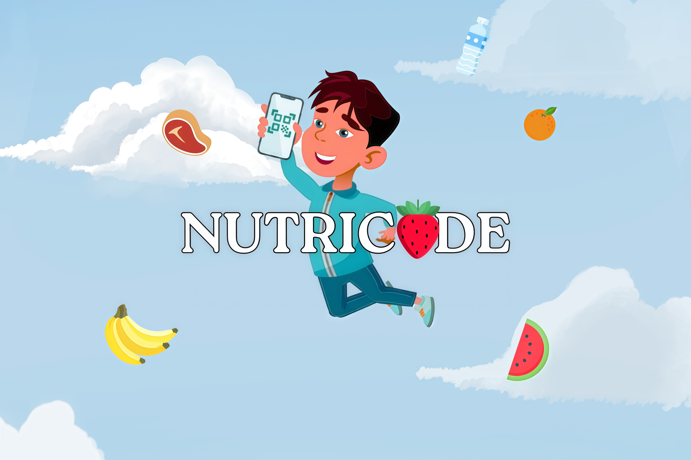

# NutriCode

<p align="center">
  
</p>


## Project Description

NutriCode is a mobile app that helps people make healthier food choices without having to read every label. Scan a product's barcode and the app instantly flags harmful additives, allergens and ultra-processed ingredients, gives a clear traffic-light verdict, and suggests better alternatives. Product data comes from the [Open Food Facts](https://world.openfoodfacts.org/) API.

This was a 4-person team project (myself (up202407610@edu.fe.up.pt), José Maio (up202404872@edu.fe.up.pt), Vasco Guimarães (up202403604@edu.fe.up.pt) and Victor Gomez (up202406138@edu.fe.up.pt)) for the Engenharia de Software (ES) course unit, FEUP, 2025/26, developed in Scrum sprints.

The full delivered report (product vision, user stories, domain model, architecture and sprint reviews) is kept intact in [`Delivered_Readme.md`](./Delivered_Readme.md).

> This repository is a personal copy (with full commit history preserved) of the original group submission on the course's GitHub organization.

## My Contribution

- Allergen filter, including its acceptance tests;
- Vegan detector, with a toggle in the user profile;
- Scan history, app settings and help & support pages;
- UI polish: themes, press feedback and the onboarding dialog;
- Vertical prototype and project documentation (README, UML, changelog).

## Tech Stack

- **Framework:** Flutter (Dart)
- **Barcode scanning:** `mobile_scanner`
- **Backend:** Firebase (Authentication with Google Sign-In, Cloud Firestore, Storage)
- **Product data:** Open Food Facts API
- **Testing:** Flutter unit and integration tests

## Running

```sh
cd nutricode
flutter pub get
flutter run
```
