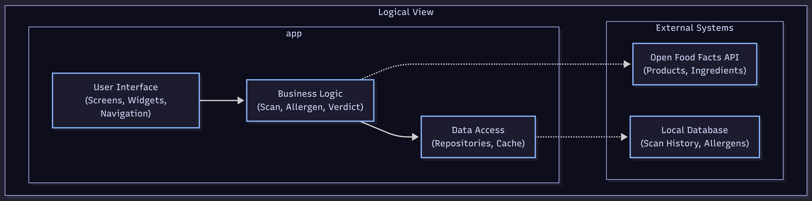
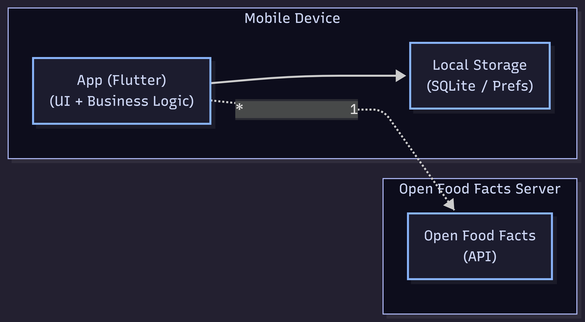

<!-- Template file for README.md for LEIC-ES-2023-24 -->

> [!NOTE] In this file, you’ll find the structure you should follow to document your mobile app in the README.md file for LEIC-ES-2024-25. It’s a single file with guidelines. You can add more sections, but for assessment normalisation and automation, include all sections of this template. Your professors will clarify about specificities of your app.

# _NutriCode_ Development Report

Welcome to the documentation pages of _NutriCode_!

This Software Development Report, tailored for LEIC-ES-2024-25, provides comprehensive details about _NutriCode_, from high-level vision to low-level implementation decisions. It’s organised by the following activities. 

* [Business modeling](#Business-Modelling) 
  * [Product Vision](#Product-Vision)
  * [Features and Assumptions](#Features-and-Assumptions)
  * [Elevator Pitch](#Elevator-pitch)
* [Requirements](#Requirements)
  * [User stories](#User-stories)
  * [Domain model](#Domain-model)
* [Architecture and Design](#Architecture-And-Design)
  * [Logical architecture](#Logical-Architecture)
  * [Physical architecture](#Physical-Architecture)
  * [Vertical prototype](#Vertical-Prototype)
* [Project management](#Project-Management)
  * [Sprint 0](#Sprint-0)
  * [Sprint 1](#Sprint-1)
  * [Sprint 2](#Sprint-2)
  * [Sprint 3](#Sprint-3)
  * [Sprint 4](#Sprint-4)
  * [Final Release](#Final-Release)

Contributions are expected to be made exclusively by the initial team, but we may open them to the community, after the course, in all areas and topics: requirements, technologies, development, experimentation, testing, etc.

Please contact us!

Thank you!

* José Maio (up202404872@up.pt)
* Miguel Mimoso (up202407610@up.pt)
* Vasco Guimarães (up202403604@up.pt)
* Victor Gomez (up202406138@up.pt)

---
## Business Modelling

Business modeling in software development involves defining the product's vision, understanding market needs, aligning features with user expectations, and setting the groundwork for strategic planning and execution.

### Product Vision

For everyone, 
who want to make informed and healthier food choices but lack the time to reserach every product,
the NutriCode 
is a mobile app that instantly reveals harmful ingredients and allergens by scanning a product bar code and provides better alternatives.
Unlike manual label reading,
our app gives a clear virtual verdict in x seconds.

<!-- 
Start by defining a clear and concise vision for your app, to help members of the team, contributors, and users into focusing their often disparate views into a concise, visual, and short textual form. 

The vision should provide a "high concept" of the product for marketers, developers, and managers.

A product vision describes the essential of the product and sets the direction to where a product is headed, and what the product will deliver in the future. 

**We favor a catchy and concise statement, ideally one sentence.**

We suggest you use the product vision template described in the following link:
* [How To Create A Convincing Product Vision To Guide Your Team, by uxstudioteam.com](https://uxstudioteam.com/ux-blog/product-vision/)

To learn more about how to write a good product vision, please see:
* [Vision, by scrumbook.org](http://scrumbook.org/value-stream/vision.html)
* [Product Management: Product Vision, by ProductPlan](https://www.productplan.com/glossary/product-vision/)
* [How to write a vision, by dummies.com](https://www.dummies.com/business/marketing/branding/how-to-write-vision-and-mission-statements-for-your-brand/)
* [20 Inspiring Vision Statement Examples (2019 Updated), by lifehack.org](https://www.lifehack.org/articles/work/20-sample-vision-statement-for-the-new-startup.html)
-->

### Features and Assumptions

Features

- **BarCode Scanner** - scan any product barcode using your phone's camera
- **Ingredient Analysis** - automatic detection of harmful additives, allergens or ultra-processed substances
- **Traffic Light System** - visual green/red verdict for quick decision making
- **Ingredient Details** - tap any flagged ingredient to see why it's harmful
- **Product History** - list previously scanned products
- **Search by Name** - find products manually when barcode is unavailable
- **Allergen Filter** - personalize alerts based on your specific allergies or intolerances
- **Favorites and Balcklists** - save safe products and flag ones to avoid

Assumptions

- Users have a smartphone with working camera
- Users will be primarily scanning packaged food products (not fresh produce)

Dependencies

- Barcode scanning via camera API
- Product Database

<!-- 
Indicate an  initial/tentative list of high-level features - high-level capabilities or desired services of the system that are necessary to deliver benefits to the users.
 - Feature XPTO - a few words to briefly describe the feature
 - Feature ABCD - ...
...

Optionally, indicate an initial/tentative list of assumptions that you are doing about the app and dependencies of the app to other systems.
-->

### Elevator Pitch

We've all been there — standing in a supermarket aisle, flipping a product over, trying to make sense of an ingredient list full of words we can't pronounce. It takes time, requires knowledge most of us don't have, and we usually just give up and buy it anyway.
Our app changes that. You scan the barcode, and almost instantly you get a green, yellow, or red verdict — no nutrition degree required. And if something is flagged, you can tap it and read exactly why it's harmful, in plain language.
It's faster than reading the label, smarter than guessing, and designed for anyone who wants to make better food choices without it feeling like homework.
If you care about what goes into your body — or know someone who does — NutriCode is the app for you.

<!-- 
Draft a small text to help you quickly introduce and describe your product in a short time (lift travel time ~90 seconds) and a few words (~800 characters), a technique usually known as elevator pitch.

Take a look at the following links to learn some techniques:
* [Crafting an Elevator Pitch](https://www.mindtools.com/pages/article/elevator-pitch.htm)
* [The Best Elevator Pitch Examples, Templates, and Tactics - A Guide to Writing an Unforgettable Elevator Speech, by strategypeak.com](https://strategypeak.com/elevator-pitch-examples/)
* [Top 7 Killer Elevator Pitch Examples, by toggl.com](https://blog.toggl.com/elevator-pitch-examples/)
-->

## Requirements

### User Stories

### US01 - Scan a Product
As a student doing grocery shopping, I want to scan a product's barcode using 
my phone camera so that I can instantly retrieve its ingredient information 
without having to read the small print on the label manually.

*Mockup:* 

  

*Acceptance Tests:*
Scenario: Successful barcode scan
  Given the user has the app open on the scan screen
  And the user points the camera at a valid product barcode
  When the barcode is recognized
  Then the app displays the product name and ingredient analysis within 3 seconds

Scenario: Product not found in database
  Given the user scans a valid barcode
  When the product is not found in the Open Food Facts database
  Then the app displays a "Product not found" message
  And suggests the user search by product name instead

*Value:* Must Have | *Effort:* 10

### US02 - View Harmful Ingredients
As a health-conscious user, I want to see harmful ingredients highlighted so that I can decide whether to buy the product.

*Acceptance Tests*:

Scenario: Harmful Ingredients Present and Highlighted

Given the user is viewing a product's ingredient details, 
when the product contains one or more flagged harmful ingredients,
then those ingredients are highlighted (e.g. in red or with a warning icon), and a brief explanation of why each is flagged is displayed.

Scenario: No Harmful Ingredients Found

Given the user is viewing a product's ingredient details,
when none of the ingredients are flagged as harmful,
then the app displays a "No harmful ingredients detected" message so the user can shop with confidence.

- *Value:* Must Have | *Effort:* 20

### US03 - Traffic Light Verdict
As a busy student, I want to see an immediate green/yellow/red verdict after scanning so that I can make a purchase decision in under 3 seconds.

*Acceptance Tests:*

Scenario: Successful scan with green verdict

  Given the product only has safe ingredients 
  When the scan is completed 
  Then A green circle and a text message saying “All ingredients are safe” are displayed. 

  Given a green verdict
  When the user taps “View Details” 
  Then the app navigates to the ingredient list without error.

Scenario: Product barcode not found in database

  Given a scanned barcode has no match in the database 
  When the lookup completes 
  Then a brown circle and a text message saying “Product Not Found” are displayed along with the barcode number.

  Given the Product Not Found is shown
  When the user taps “Search the Internet” 
  Then the default web browser opens and automatically searches for the barcode number also displayed.

  Given the Product Not Found is shown
  When the user taps “Scan again” 
  Then the camera reopens and previous scan is dismissed.

- *Value:* Must Have | *Effort:* 13

### US04 - Ingredient Details
As a curious user, I want to tap on a flagged ingredient and read why it is harmful so that I can understand what I am putting in my body.

*Acceptance Tests:*

Scenario: User taps red-flagged ingredient and reads explanation

  Given a red-flagged ingredient is shown
  When the user taps it 
  Then a description panel appears containing the ingredient name and the stored explanation

  Given the description panel is open 
  When the user taps outside of it 
  Then the panel closes and the ingredient list is fully visible again.

Scenario: Explanation data unavailable

  Given a red-flagged ingredient is shown whose explanation is not in the database, 
  When the user taps it 
  Then a description panel appears containing a message saying the explanation is not available and a button to search about it online.

  Given a message saying the explanation is unavailable 
  When the user taps the “Search online” button 
  Then the device browser opens with a search query pre-filled with the ingredient name

  Given the description panel saying the content is unavailable
  When the user taps outside of it 
  Then the ingredient list is fully shown again.

  
- *Value:* Should Have | *Effort:* 13

### US05 - Allergen Filter
As a user with food allergies, I want to configure my personal allergens so that the app alerts me whenever a scanned product contains them.

*Acceptance Tests:*

Scenario: Allergen match detected on scan

 Given the user has configured 'Milk' as a personal allergen
 When the user scans a product containing milk
 Then a red alert banner is shown immediately with the allergen name highlighted
 And a 'See Alternatives' button appears

 Given the user has set 'Soy' as a personal allergen
 And the user scans a product containing soy lecithin
 When the scan result loads
 Then a 'See Alternatives' button appears below the alert banner

 Given the user has set 'Eggs' and 'Nuts' as personal allergens
 And the user scans a product containing eggs
 When the scan result loads
 Then only the matching allergen 'Eggs' is highlighted in the alert
 
Scenario: Product has no allergen data

 Given the user has allergens configured and scans a product with no allergen data
 When the scan result loads
 Then a yellow warning is shown: 'Allergen data unavailable — check the physical label'
 And no green 'safe' banner is shown

 Given the user has set 'Celery' as a personal allergen
 And the user scans a recently added artisanal soup with no allergen mapping
 When the scan result loads
 Then no green 'safe' banner is displayed anywhere on the result screen

 
- *Value:* Should Have | *Effort:* 8

### US06 - Scan History
As a returning user, I want to access a history of previously scanned products so that I can re-consult them without scanning again.

Scenario: User opens history with previous scans

 Given the user has previously scanned at least one product
 When the user opens the History screen
 Then a list of previously scanned products is shown, ordered by most recent first

 Given the user scanned 50 different products over the last month
 And the user opens the app after a week without scanning
 When the user opens the History screen
 Then all 50 products are listed with their name, thumbnail and scan date

Scenario: History is empty

 Given the user has no scan history
 When the user opens the History screen
 Then an empty state is shown with a message and a 'Scan Now' button

 Given the user has no scan history
 And the user lands on the History screen for the first time
 When the user taps the 'Scan Now' button
 Then the app navigates directly to the scan screen

 Given the user has no scan history
 And the user has just switched to a new device and restored the app
 When the user opens the History screen
 Then the empty state is shown with no leftover data from the previous device

 
- *Value:* Should Have | *Effort:* 3

### US07 - Search by Product Name
As a user with a damaged barcode, I want to search for a product by name so that I can still access its ingredient information.

*Acceptance Tests:*

Scenario: Successful Search and View Ingredients.
Description: User enters a product name, selects from results, and views ingredients.
Acceptance Tests: Given the user is on the search screen, when they enter "Coca-Cola" in the search bar and submit, then a list of matching products appears, and selecting one displays its ingredient details.

Exceptional Scenario: No Results Found
Description: User searches for a non-existent or misspelled product name, receiving a helpful error message with suggestions like scan bar-code.
Given the user is on the search screen, when they enter "Koka-kola" (misspelled) and submit, Then a "No results found" message displays, and no ingredient details load.
- *Value:* Could Have | *Effort:* 5

### US08 - Save Favourite Products
As a regular shopper, I want to save trusted products to a favourites list so that I can quickly confirm they are still safe on future trips.

*Acceptance Tests:*

Scenario: Add and View Favorite.
Description: From a product detail page, user adds to favorites; later accesses the list to view saved items.
Acceptance Tests: Given the user is viewing a product detail, when they tap "Add to Favorites," Then the product appears in the favorites list, and tapping it shows updated ingredient info.

Exceptional Scenario: Remove Favorite or Offline Access
Description: User removes an item from favorites; or accesses list offline, seeing cached data with a warning for potential updates.
Acceptance Tests: Given the user has favorites saved and is offline, when they open the favorites list, then cached products appear.
- *Value:* Could Have | *Effort:* 2
<!-- 
In this section, you should describe all kinds of requirements for your module: functional and non-functional requirements.

For LEIC-ES-2024-25, the requirements will be gathered and documented as user stories. 

Please add in this section a concise summary of all the user stories.

**User stories as GitHub Project Items**
The user stories themselves should be created and described as items in your GitHub Project with the label "user story". 

A user story is a description of a desired functionality told from the perspective of the user or customer. A starting template for the description of a user story is *As a < user role >, I want < goal > so that < reason >.*

Name the item with either the full user story or a shorter name. In the “comments” field, add relevant notes, mockup images, and acceptance test scenarios, linking to the acceptance test in Gherkin when available, and finally estimate value and effort.

**INVEST in good user stories**. 
You may add more details after, but the shorter and complete, the better. In order to decide if the user story is good, please follow the [INVEST guidelines](https://xp123.com/articles/invest-in-good-stories-and-smart-tasks/).

**User interface mockups**.
After the user story text, you should add a draft of the corresponding user interfaces, a simple mockup or draft, if applicable.

**Acceptance tests**.
For each user story you should write also the acceptance tests (textually in [Gherkin](https://cucumber.io/docs/gherkin/reference/)), i.e., a description of scenarios (situations) that will help to confirm that the system satisfies the requirements addressed by the user story.

**Value and effort**.
At the end, it is good to add a rough indication of the value of the user story to the customers (e.g. [MoSCoW](https://en.wikipedia.org/wiki/MoSCoW_method) method) and the team should add an estimation of the effort to implement it, for example, using points in a kind-of-a Fibonnacci scale (1,2,3,5,8,13,20,40, no idea).

-->

### Domain model

  

<!-- 
To better understand the context of the software system, it is useful to have a simple UML class diagram with all and only the key concepts (names, attributes) and relationships involved of the problem domain addressed by your app. 
Also provide a short textual description of each concept (domain class). 

Example:
 

  

-->

## Architecture and Design

The logical architecture of NutriCode is organized into distinct packages that separate the mobile application's internal concerns from its external dependencies. This structure ensures a clean separation of concerns, making the codebase easier to maintain, test, and scale.
<!--
The architecture of a software system encompasses the set of key decisions about its organization. 

A well written architecture document is brief and reduces the amount of time it takes new programmers to a project to understand the code to feel able to make modifications and enhancements.

To document the architecture requires describing the decomposition of the system in their parts (high-level components) and the key behaviors and collaborations between them. 

In this section you should start by briefly describing the components of the project and their interrelations. You should describe how you solved typical problems you may have encountered, pointing to well-known architectural and design patterns, if applicable.
-->

### Logical architecture

The logical architecture of NutriCode is organized into distinct packages that separate the mobile application's internal concerns from its external dependencies. This structure ensures a clean separation of concerns, making the codebase easier to maintain, test, and scale.

The system is encapsulated within a main `Logical View`, which is divided into two primary subsystems: `app` and `External Systems`.

#### 1. App
This subsystem contains the core layers of the mobile application itself:
* **User Interface:** Manages the presentation layer, including all screens, UI widgets, and navigation logic. It depends directly on the Business Logic layer to trigger actions.
* **Business Logic:** Acts as the brain of the app. It handles the core domain operations, such as triggering a scan, applying allergen filters, and calculating the final traffic-light verdict. 
* **Data Access:** Responsible for abstracting data retrieval and storage. It uses repositories to fetch data from external sources or local caches, ensuring the Business Logic layer doesn't need to know where the data comes from.

#### 2. External Systems
This subsystem represents the boundaries outside the core application code:
* **Open Food Facts API:** An external REST API that the Business Logic layer relies on to fetch raw product and ingredient data based on the scanned barcodes.
* **Local Database:** The device's local storage (e.g., SQLite), which the Data Access layer depends on to persist user-specific data like scan history and configured allergens.

<!--
The purpose of this subsection is to document the high-level logical structure of the code (Logical View), using a UML diagram with logical packages, without the worry of allocating to components, processes or machines.

It can be beneficial to present the system in a horizontal decomposition, defining layers and implementation concepts, such as the user interface, business logic and concepts.

Example of _UML package diagram_ showing a _logical view_ of the Eletronic Ticketing System (to be accompanied by a short description of each package):

-->

### Physical architecture

The physical architecture of NutriCode follows a standard client-server deployment model, consisting of a mobile client device and an external data server. This section outlines the physical nodes, the software components deployed on them, and the rationale behind our technological choices.

**1. Mobile Device (Client Node)**
This is the user's physical smartphone (Android or iOS). It hosts the core executable artifacts of our system:
* **App (Flutter):** The main application containing both the User Interface and the Business Logic. 
  * *Justification:* We chose **Flutter** (and the Dart language) because it allows us to build natively compiled applications for both mobile platforms from a single codebase, significantly speeding up development time. It also has excellent, highly responsive plugins for hardware access (like the device camera for barcode scanning).
* **Local Storage:** The local database residing on the device's storage.
  * *Justification:* We are utilizing **SQLite** (and Shared Preferences) to persist user data, such as their configured allergen filters, scan history, and favorite products. This ensures that users can access their saved data even when offline and reduces unnecessary network requests.

**2. Open Food Facts Server (External Node)**
This represents the remote cloud infrastructure that hosts the product database.
* **Open Food Facts API:** A RESTful web service.
  * *Justification:* Instead of building and maintaining our own proprietary database of millions of food products, we chose to integrate with the **Open Food Facts API**. It is a comprehensive, open-source, and crowdsourced database that provides all the nutritional and ingredient data we need based on standard EAN/UPC barcodes.

**Connections**
The Mobile Device communicates with the Open Food Facts Server over the internet via standard **HTTPS** protocols. The app sends an HTTP GET request containing the scanned barcode string, and the server responds with a JSON payload containing the product's ingredient details, which the app then parses and evaluates.

<!--
The goal of this subsection is to document the high-level physical structure of the software system (machines, connections, software components installed, and their dependencies) using UML deployment diagrams (Deployment View) or component diagrams (Implementation View), separate or integrated, showing the physical structure of the system.

It should describe also the technologies considered and justify the selections made. Examples of technologies relevant for ESOF are, for example, frameworks for mobile applications (such as Flutter).

Example of _UML deployment diagram_ showing a _deployment view_ of the Eletronic Ticketing System (please notice that, instead of software components, one should represent their physical/executable manifestations for deployment, called artifacts in UML; the diagram should be accompanied by a short description of each node and artifact):

-->

### Vertical prototype
<!--
To help on validating all the architectural, design and technological decisions made, we usually implement a vertical prototype, a thin vertical slice of the system integrating as much technologies we can.

In this subsection please describe which feature, or part of it, you have implemented, and how, together with a snapshot of the user interface, if applicable.

At this phase, instead of a complete user story, you can simply implement a small part of a feature that demonstrates thay you can use the technology, for example, show a screen with the app credits (name and authors).
-->

## Project management
<!--
Software project management is the art and science of planning and leading software projects, in which software projects are planned, implemented, monitored and controlled.

In the context of ESOF, we recommend each team to adopt a set of project management practices and tools capable of registering tasks, assigning tasks to team members, adding estimations to tasks, monitor tasks progress, and therefore being able to track their projects.

Common practices of managing agile software development with Scrum are: backlog management, release management, estimation, Sprint planning, Sprint development, acceptance tests, and Sprint retrospectives.

You can find below information and references related with the project management: 

* Backlog management: Product backlog and Sprint backlog in a [Github Projects board](https://github.com/orgs/FEUP-LEIC-ES-2023-24/projects/64);
* Release management: [v0](#), v1, v2, v3, ...;
* Sprint planning and retrospectives: 
  * plans: screenshots of Github Projects board at begin and end of each Sprint;
  * retrospectives: meeting notes in a document in the repository, addressing the following questions:
    * Did well: things we did well and should continue;
    * Do differently: things we should do differently and how;
    * Puzzles: things we don’t know yet if they are right or wrong… 
    * list of a few improvements to implement next Sprint;

-->

### Sprint 0

### Sprint 1

### Sprint 2

### Sprint 3

### Sprint 4

### Final Release

